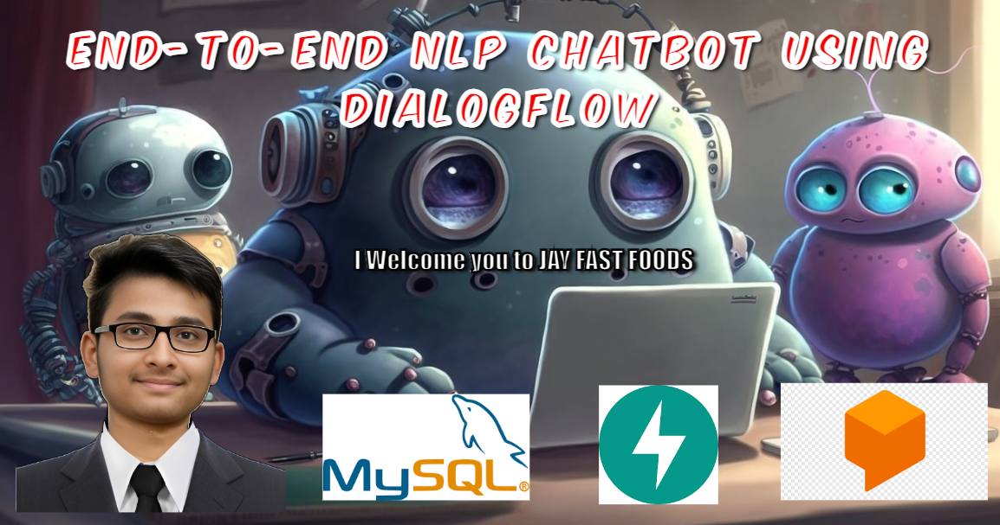

# Watch the Video: 
### My Reflection: Introduction: NLP Chatbot using Dialogflow

  

- **Project Overview:**
  - End-to-end NLP chatbot developed using Dialogflow.
  - Diverse menu featuring items like Pav Bhaji, Chole Bhature, Pizza, Mango Lassi, Masala Dosa, Biryani, Vada Pav, Rava Dosa, and Samosa.

- **Guidance and Mentorship:**
  - Guided by Dhaval Patel sir from the Codebasics YouTube channel.
  - Embarked on the journey to build a fully functional chatbot with his mentorship.
  - Gained insights into project scoping, solution design, architecture, and implementation.

- **Project Development Phases:**
  - Defined project scope and feasibility.
  - Prioritized features based on impact and practicality.
  - Created the Minimum Viable Product (MVP) focusing on essential features like placing and tracking orders.

- **Project Management:**
  - Explored Agile Methodology and the Scrum Process.
  - Used tools like Jira, Notion, and Asana for project management.
  - Tracked backlog, MVP, and project phases to ensure smooth progress.

- **Dialogflow Integration:**
  - Explored Dialogflow for creating chatbot intents, fulfillments, entities, and integrations.
  - Learned how intents map user intentions to specific actions.
  - Emphasized the importance of defining entities to extract relevant information.

- **Backend Implementation:**
  - Chose FastAPI over Flask for backend development.
  - Appreciated FastAPI's simplicity, speed, and ease of defining endpoints and handling data validation.
  - Used MySQL as the database to store order and order tracking details.

- **Challenges and Reflection:**
  - Recognized limited practicality due to the absence of partnerships with fast-food centers for order fulfillment.
  - Proud of the knowledge and skills acquired throughout the process.

- **Acknowledgments:**
  - Thank you, Dhaval Patel sir, for providing free and valuable resources for data science on YouTube.

# Website Image demo:

